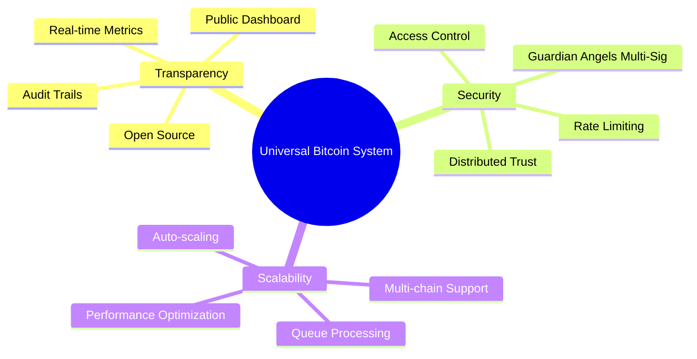
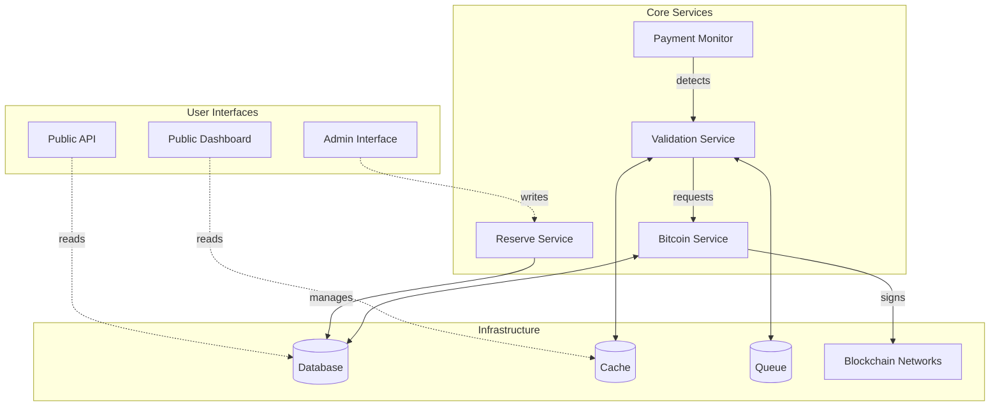
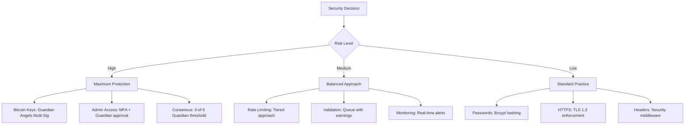
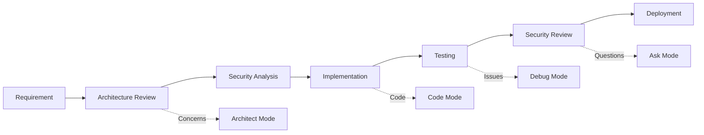
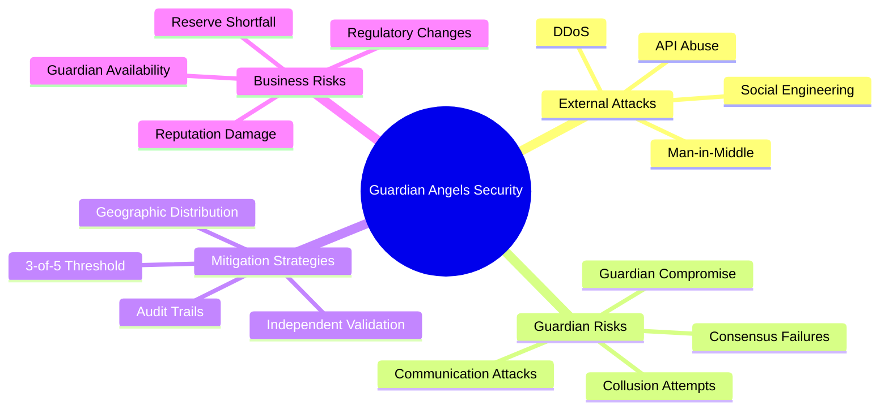
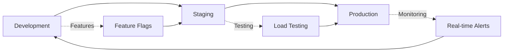

# Universal Bitcoin Project Memory Map

## 🧠 Mental Model Overview

This memory map serves as the **cognitive foundation** for the Universal Bitcoin proof-of-reserves system. It captures the essential relationships, decision points, and development patterns that define how this system operates and evolves.

## 🎯 Core Concept Map

```
                    ╔═══════════════════════════════════╗
                    ║        CORE PRINCIPLE             ║
                    ║                                   ║
                    ║    "Anyone can verify that        ║
                    ║     UniversalBTC (uBTC) tokens        ║
                    ║     are backed by real BTC"       ║
                    ╚═══════════════════════════════════╝
                                    │
                    ╔═══════════════▼═══════════════════╗
                    ║         PROOF MECHANISM           ║
                    ║                                   ║
                    ║  Pay → Request → Sign → Verify    ║
                    ║   ↑       ↑       ↑       ↑      ║
                    ║  Fee   Message  Bitcoin  Public   ║
                    ║ (ETH/   (Custom) Wallet  Audit    ║
                    ║  SOL)            Control          ║
                    ╚═══════════════════════════════════╝
```

## 🏗️ System Mental Framework

### 1. **The Three Pillars**



### 2. **The Value Flow**

```
┌─────────────┐    ┌─────────────┐    ┌─────────────┐    ┌─────────────┐
│    USER     │───▶│   PAYMENT   │───▶│ VALIDATION  │───▶│   PROOF     │
│             │    │             │    │             │    │             │
│ • Validator │    │ • ETH/SOL   │    │ • Queue     │    │ • Signature │
│ • Auditor   │    │ • Message   │    │ • Process   │    │ • Evidence  │
│ • Holder    │    │ • Address   │    │ • Sign      │    │ • Trust     │
└─────────────┘    └─────────────┘    └─────────────┘    └─────────────┘
      ▲                                                         │
      │                                                         │
      └─────────────────── CONFIDENCE LOOP ─────────────────────┘
```

## 🧩 Component Relationships

### Core Service Dependencies



### Data Flow Patterns

**Pattern 1: Validation Request Flow**
```
Payment Detection → Rate Check → Queue → Sign → Store → Notify
      ↑               ↑           ↑       ↑       ↑       ↑
   Monitor          Limit      Process  Bitcoin  Cache  Webhook
```

**Pattern 2: Reserve Management Flow**
```
Admin Action → Validation → Bitcoin Op → Token Op → Update → Audit
     ↑            ↑           ↑           ↑         ↑       ↑
   Interface   Permission   Wallet     Contract  Database  Log
```

**Pattern 3: Public Verification Flow**
```
User Query → Cache Check → Database → Calculate → Return → Cache
    ↑           ↑            ↑          ↑         ↑       ↑
  Request    Hit/Miss     Historical  Ratios   Result  Update
```

## 🔑 Key Decision Points & Rationale

### 1. **Architecture Decisions**

| Decision | Chosen Approach | Alternative | Rationale |
|----------|----------------|-------------|-----------|
| **Payment Detection** | Active polling blockchain | Event subscriptions | More reliable, handles network issues |
| **Key Management** | Guardian Angels Multi-Sig | Software keys or HSM | Enhanced security through distributed trust |
| **Rate Limiting** | No refunds, queue processing | Reject excess requests | Revenue preservation, work completion |
| **Database** | PostgreSQL + TimescaleDB | MongoDB/NoSQL | ACID compliance, time-series capabilities |
| **Caching** | Multi-layer Redis | Single-layer cache | Performance optimization, flexibility |
| **Queues** | Bull (Redis-based) | AWS SQS/RabbitMQ | Consistency with cache, lower complexity |

### 2. **Security Decisions**



### 3. **Scalability Decisions**

**Horizontal Scaling Strategy:**
```
Load Balancer → API Instances (Auto-scale) → Core Services → Database Cluster
      ↑              ↑                           ↑                ↑
   Nginx         PM2/Docker              Dedicated Workers    Master/Replica
```

## 🗂️ Project Structure Mental Map

### Directory Philosophy
```
src/
├── api/           # External interfaces (REST endpoints)
├── services/      # Business logic (domain services)
├── blockchain/    # External integrations (chain adapters)
├── security/      # Cross-cutting concerns (encryption, auth)
├── validation/    # Core domain logic (proof generation)
└── webhooks/      # External notifications (event system)
```

### File Naming Conventions
- **Services**: `[domain].service.js` (e.g., `validation.service.js`)
- **Controllers**: `[endpoint].controller.js` (e.g., `reserves.controller.js`)
- **Models**: `[entity].model.js` (e.g., `validation.model.js`)
- **Utils**: `[purpose].util.js` (e.g., `encryption.util.js`)
- **Tests**: `[module].test.js` or `[module].spec.js`

### Configuration Hierarchy
```
config/
├── default.js     # Base configuration
├── development.js # Dev overrides
├── production.js  # Prod overrides
├── test.js        # Test overrides
└── chains/        # Chain-specific configs
    ├── ethereum.js
    ├── solana.js
    └── polygon.js
```

## 💭 Development Workflow Mental Model

### 1. **Feature Development Flow**



### 2. **Testing Pyramid Strategy**

```
                    ╔═══════════════╗
                    ║   E2E Tests   ║  ← Full system validation
                    ║   (Few)       ║
                    ╚═══════════════╝
                 ╔═══════════════════════╗
                 ║   Integration Tests   ║  ← Service interactions
                 ║   (Some)              ║
                 ╚═══════════════════════╝
          ╔═══════════════════════════════════╗
          ║        Unit Tests               ║  ← Individual functions
          ║        (Many)                   ║
          ╚═══════════════════════════════════╝
```

### 3. **Code Quality Gates**

| Stage | Check | Tool | Threshold |
|-------|-------|------|-----------|
| **Commit** | Lint | ESLint | No errors |
| **Push** | Test | Jest | 95% coverage |
| **PR** | Security | npm audit | No high/critical |
| **Deploy** | Performance | Load test | <500ms p95 |

## 🔐 Security Mental Model

### Guardian Angels Security Model



### Defense Layers

```
┌─────────────────────────────────────────────────────────┐
│                    PUBLIC USERS                         │
├─────────────────────────────────────────────────────────┤
│  Layer 1: Network Security (WAF, DDoS, IP filtering)   │
├─────────────────────────────────────────────────────────┤
│  Layer 2: Application Security (Rate limit, Auth)      │
├─────────────────────────────────────────────────────────┤
│  Layer 3: Business Logic Security (Validation)         │
├─────────────────────────────────────────────────────────┤
│  Layer 4: Data Security (Encryption, Access Control)   │
├─────────────────────────────────────────────────────────┤
│  Layer 5: Infrastructure Security (OS, Network)        │
└─────────────────────────────────────────────────────────┘
```

## 📊 Data Architecture Mental Model

### Data Flow Patterns

**CQRS Pattern Implementation:**
```
Commands (Write)                    Queries (Read)
      ↓                                  ↑
┌─────────────┐                    ┌─────────────┐
│ Command     │                    │ Query       │
│ Handler     │                    │ Handler     │
└─────────────┘                    └─────────────┘
      ↓                                  ↑
┌─────────────┐    Events       ┌─────────────┐
│ Write       │ ──────────────▶ │ Read        │
│ Database    │                 │ Models      │
└─────────────┘                 └─────────────┘
```

### Caching Strategy

```
Request → L1 Cache → L2 Cache → Database → Update Caches
   ↑         ↑          ↑          ↑           ↑
Response   API       Query     Persistent   Background
          Cache     Cache       Data        Updates
```

## 🚀 Deployment Mental Model

### Environment Progression



### Infrastructure Philosophy

**Infrastructure as Code Mindset:**
- Every resource defined in code
- Version controlled configurations
- Reproducible deployments
- Automated disaster recovery

**Container Strategy:**
```
Application → Docker Image → Kubernetes Pod → Service Mesh
     ↑             ↑             ↑              ↑
   Source       Build         Runtime       Network
```

## 🔄 Operational Mental Model

### Monitoring Philosophy

**The Four Golden Signals:**
1. **Latency** - How long requests take
2. **Traffic** - How many requests per second
3. **Errors** - Rate of failed requests
4. **Saturation** - How "full" the service is

**Custom Business Metrics:**
- Validation success rate
- Reserve ratio health
- Revenue per chain
- Customer satisfaction

### Incident Response Mindset

```
Detection → Assessment → Response → Recovery → Learning
    ↑            ↑           ↑          ↑         ↑
 Automated    Severity    Mitigation  Restore   Improve
   Alerts    Classification  Actions   Service   System
```

## 🎯 Success Metrics Mental Model

### Key Performance Indicators

**Technical KPIs:**
- API response time < 500ms (p95)
- System uptime > 99.9%
- Validation success rate > 99%
- Queue processing time < 30s

**Business KPIs:**
- Monthly active validators
- Revenue growth rate
- Reserve ratio consistency
- Customer retention rate

**Security KPIs:**
- Zero key compromises
- Rate limit effectiveness
- Security incident response time
- Audit compliance score

## 🧪 Testing Philosophy

### Testing Mental Model

```mermaid
pyramid
    title Testing Pyramid
    
    "E2E Tests" : 10
    "Integration Tests" : 30
    "Unit Tests" : 60
```

**Test Categories:**
- **Unit Tests**: Individual function behavior
- **Integration Tests**: Service interactions
- **Contract Tests**: API compatibility
- **Security Tests**: Vulnerability scanning
- **Performance Tests**: Load and stress testing
- **E2E Tests**: Complete user workflows

## 🔮 Future Evolution Path

### Upgrade Strategy

**Phase 1 → 2 Migration:**
```
Software Keys → HSM Integration
Single Region → Multi-region
Manual Ops → Automated Ops
Basic Analytics → ML Analytics
```

**Phase 2 → 3 Evolution:**
```
Centralized → Decentralized Governance  
Manual → Automated Cross-chain
Basic → Advanced Compliance
Single Product → Platform
```

## 🎓 Learning Resources

### Essential Reading
1. **Bitcoin Development**: Understanding message signing
2. **Multi-chain Architecture**: Cross-chain patterns
3. **Proof of Reserves**: Industry best practices
4. **Security Patterns**: Cryptographic protocols
5. **Distributed Systems**: Scaling and reliability

### Skills Development Priority
1. **Blockchain Integration** (High)
2. **Cryptographic Security** (High)
3. **System Architecture** (Medium)
4. **Performance Optimization** (Medium)
5. **DevOps & Monitoring** (Medium)

---

## 💡 Mental Shortcuts & Heuristics

### Decision Framework
**When considering changes, ask:**
1. Does this improve transparency?
2. Does this maintain security?
3. Does this scale efficiently?
4. Does this simplify operations?

### Code Review Checklist
- ✅ Security implications considered?
- ✅ Error handling comprehensive?
- ✅ Performance impact assessed?
- ✅ Tests cover edge cases?
- ✅ Documentation updated?

### Debugging Approach
1. **Logs First**: Check structured logs
2. **Metrics Second**: Review dashboards
3. **Traces Third**: Follow request path
4. **Code Last**: Only when necessary

---

This memory map serves as your **cognitive GPS** for navigating the Universal Bitcoin project. It captures not just what the system does, but how to think about it, modify it, and evolve it over time.