# Universal Bitcoin System Architecture

## 🏗️ System Overview

The Universal Bitcoin proof-of-reserves system is designed as a transparent, scalable, and secure multi-chain validation platform. The architecture follows microservices principles with clear separation of concerns, ensuring high availability and maintainability.

## 🎯 Core Design Principles

### 1. **Transparency First**
- All reserve data publicly accessible
- Cryptographic proof of Bitcoin control
- Immutable audit trails
- Real-time validation statistics

### 2. **Security by Design**
- Defense in depth strategy
- Encrypted key storage
- Rate limiting and anti-spam
- Comprehensive access controls

### 3. **Multi-Chain Native**
- Blockchain-agnostic core engine
- Pluggable chain adapters
- Unified reserve management
- Cross-chain consistency

### 4. **High Availability**
- Redundant service architecture
- Graceful failure handling
- Queue-based processing
- Auto-scaling capabilities

### 5. **Multi-Layer Security Architecture**
- **Guardian Angels Multi-Signature**: Multiple trusted parties control Bitcoin signing with M-of-N signatures
- **DLC Reserve Protection**: 80% of reserves locked in immutable Discrete Log Contracts
- **Liquidity Provider System**: 20% liquid reserves managed by economic incentive system
- **Advanced Script Engine**: Complex Bitcoin script compilation and execution
- **Oracle Integration**: External data feeds for automated contract execution
- **Distributed Trust Model**: No single point of failure across all security layers

## 🔧 System Components

### Enhanced Security Architecture

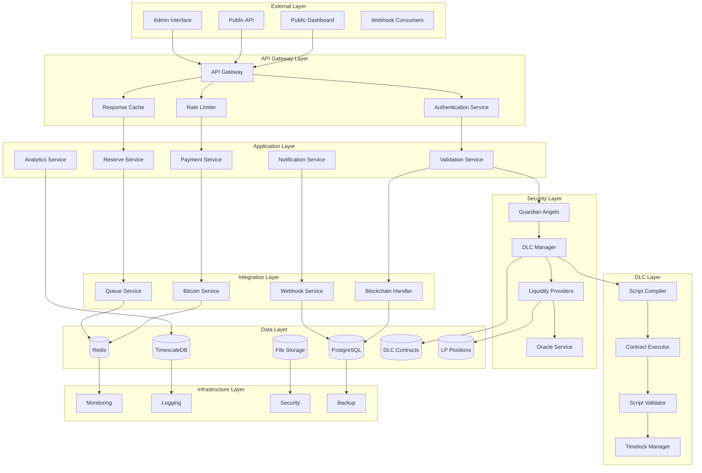

## 📊 Data Architecture

### Database Schema Design

#### Core Tables

**Validations Table**
```sql
CREATE TABLE validations (
    id UUID PRIMARY KEY DEFAULT gen_random_uuid(),
    chain VARCHAR(50) NOT NULL,
    tx_hash VARCHAR(128) NOT NULL,
    from_address VARCHAR(128) NOT NULL,
    amount DECIMAL(20,8) NOT NULL,
    message TEXT NOT NULL,
    status VARCHAR(20) DEFAULT 'pending',
    bitcoin_signature TEXT,
    bitcoin_address VARCHAR(64),
    created_at TIMESTAMP DEFAULT NOW(),
    processed_at TIMESTAMP,
    UNIQUE(chain, tx_hash)
);
```

**Bitcoin Wallets Table**
```sql
CREATE TABLE bitcoin_wallets (
    id UUID PRIMARY KEY DEFAULT gen_random_uuid(),
    address VARCHAR(64) NOT NULL UNIQUE,
    encrypted_private_key TEXT NOT NULL,
    balance DECIMAL(20,8) DEFAULT 0,
    is_active BOOLEAN DEFAULT true,
    created_at TIMESTAMP DEFAULT NOW(),
    last_used_at TIMESTAMP
);
```

**Chain Tokens Table**
```sql
CREATE TABLE chain_tokens (
    id UUID PRIMARY KEY DEFAULT gen_random_uuid(),
    chain VARCHAR(50) NOT NULL,
    contract_address VARCHAR(128),
    total_supply DECIMAL(20,8) DEFAULT 0,
    backed_by_wallet_id UUID REFERENCES bitcoin_wallets(id),
    created_at TIMESTAMP DEFAULT NOW(),
    updated_at TIMESTAMP DEFAULT NOW()
);
```

**DLC Contracts Table**
```sql
CREATE TABLE dlc_contracts (
    id UUID PRIMARY KEY DEFAULT gen_random_uuid(),
    contract_id VARCHAR(128) UNIQUE NOT NULL,
    contract_type VARCHAR(50) NOT NULL, -- 'timelock', 'oracle', 'emergency'
    bitcoin_amount DECIMAL(20,8) NOT NULL,
    locked_until TIMESTAMP,
    oracle_conditions JSONB,
    guardian_threshold INTEGER DEFAULT 4,
    compiled_script TEXT NOT NULL,
    script_hash VARCHAR(64) NOT NULL,
    funding_tx_id VARCHAR(128),
    status VARCHAR(20) DEFAULT 'pending', -- 'pending', 'active', 'executed', 'expired'
    created_at TIMESTAMP DEFAULT NOW(),
    executed_at TIMESTAMP
);
```

**Liquidity Providers Table**
```sql
CREATE TABLE liquidity_providers (
    id UUID PRIMARY KEY DEFAULT gen_random_uuid(),
    provider_address VARCHAR(128) NOT NULL,
    chain VARCHAR(50) NOT NULL,
    collateral_amount DECIMAL(20,8) NOT NULL,
    liquid_amount DECIMAL(20,8) NOT NULL,
    collateral_ratio DECIMAL(10,4) NOT NULL,
    reward_rate DECIMAL(10,6) DEFAULT 0.05,
    penalty_amount DECIMAL(20,8) DEFAULT 0,
    status VARCHAR(20) DEFAULT 'active', -- 'active', 'liquidating', 'liquidated'
    last_update TIMESTAMP DEFAULT NOW(),
    created_at TIMESTAMP DEFAULT NOW(),
    UNIQUE(provider_address, chain)
);
```

**Oracle Events Table**
```sql
CREATE TABLE oracle_events (
    id UUID PRIMARY KEY DEFAULT gen_random_uuid(),
    oracle_id VARCHAR(128) NOT NULL,
    event_type VARCHAR(50) NOT NULL,
    event_data JSONB NOT NULL,
    signatures JSONB, -- Array of oracle signatures
    consensus_reached BOOLEAN DEFAULT false,
    dlc_contract_id UUID REFERENCES dlc_contracts(id),
    timestamp TIMESTAMP DEFAULT NOW()
);
```

**Guardian Consensus Table**
```sql
CREATE TABLE guardian_consensus (
    id UUID PRIMARY KEY DEFAULT gen_random_uuid(),
    operation_type VARCHAR(50) NOT NULL, -- 'validation', 'dlc_emergency', 'lp_liquidation'
    operation_id UUID NOT NULL,
    guardian_signatures JSONB NOT NULL,
    required_threshold INTEGER NOT NULL,
    current_approvals INTEGER DEFAULT 0,
    status VARCHAR(20) DEFAULT 'pending', -- 'pending', 'approved', 'rejected', 'expired'
    expires_at TIMESTAMP NOT NULL,
    created_at TIMESTAMP DEFAULT NOW(),
    completed_at TIMESTAMP
);
```

**Audit Logs Table**
```sql
CREATE TABLE audit_logs (
    id UUID PRIMARY KEY DEFAULT gen_random_uuid(),
    event_type VARCHAR(50) NOT NULL,
    user_id UUID,
    resource_type VARCHAR(50),
    resource_id UUID,
    old_values JSONB,
    new_values JSONB,
    security_level VARCHAR(20) DEFAULT 'low', -- 'low', 'medium', 'high', 'critical'
    dlc_contract_id UUID,
    lp_provider_id UUID,
    ip_address INET,
    user_agent TEXT,
    created_at TIMESTAMP DEFAULT NOW()
);
```

#### Time-Series Data (TimescaleDB)

**Validation Metrics**
```sql
CREATE TABLE validation_metrics (
    time TIMESTAMPTZ NOT NULL,
    chain VARCHAR(50) NOT NULL,
    validations_count INTEGER DEFAULT 0,
    average_response_time INTERVAL,
    success_rate DECIMAL(5,4),
    total_fees DECIMAL(20,8)
);

SELECT create_hypertable('validation_metrics', 'time');
```

**Reserve Ratios**
```sql
CREATE TABLE reserve_ratios (
    time TIMESTAMPTZ NOT NULL,
    chain VARCHAR(50) NOT NULL,
    btc_reserves DECIMAL(20,8),
    token_supply DECIMAL(20,8),
    ratio DECIMAL(10,8),
    is_healthy BOOLEAN
);

SELECT create_hypertable('reserve_ratios', 'time');
```

### Cache Strategy (Redis)

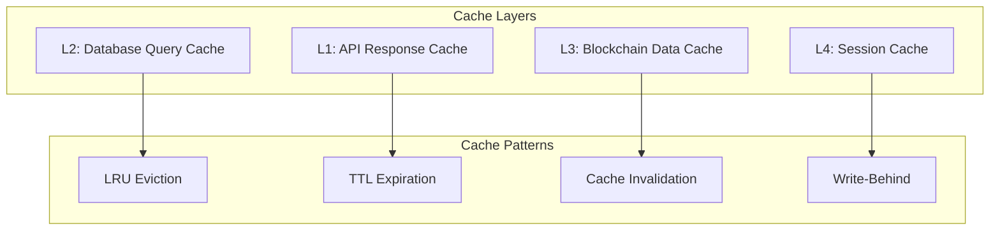

**Cache Configuration**
```yaml
cache_config:
  api_responses:
    ttl: 300  # 5 minutes
    max_size: 10000
  
  blockchain_data:
    ttl: 60   # 1 minute
    max_size: 5000
  
  validation_results:
    ttl: 3600 # 1 hour
    max_size: 50000
  
  reserve_data:
    ttl: 30   # 30 seconds
    max_size: 1000
```

## 🔒 Multi-Layer Security Architecture

### DLC + LP + Guardian Angels Security Model

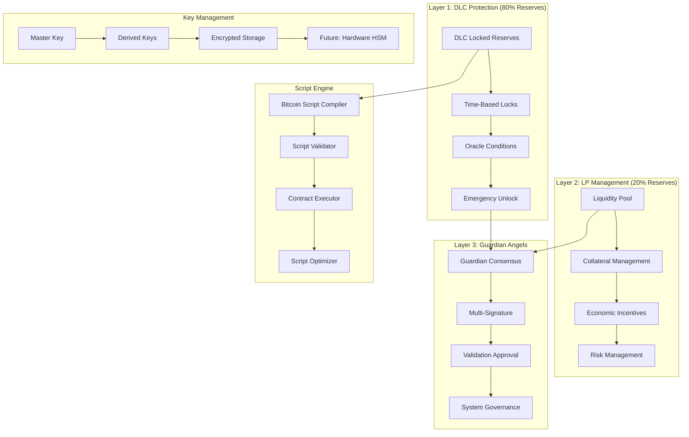

### DLC Security Architecture

#### Discrete Log Contract Framework
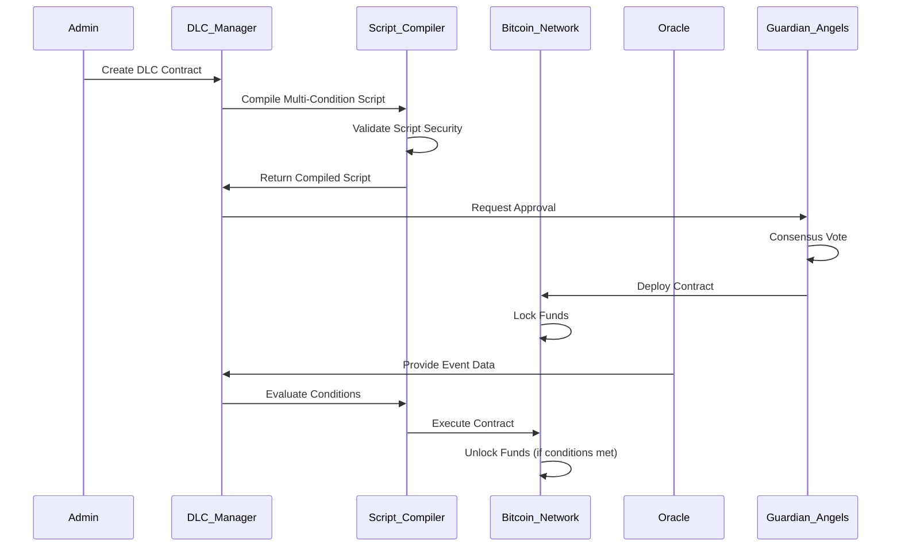

#### Bitcoin Script Compilation Pipeline
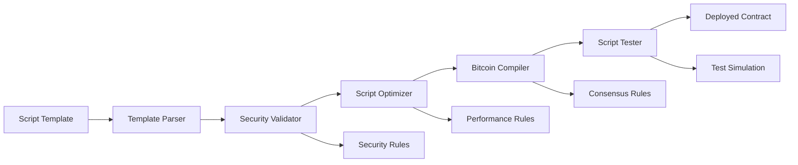

### Enhanced Security Layers

#### 1. **DLC Security Layer (Tier 1 - Maximum Protection)**
- **Immutable Contracts**: 80% of reserves locked in mathematically enforced contracts
- **Time-Lock Protection**: Minimum 24-hour unlock delay for all operations
- **Oracle Consensus**: 2-of-3 oracle signatures required for condition-based unlocks
- **Emergency Override**: 4-of-5 Guardian consensus for emergency access
- **Script Validation**: Formal verification of all Bitcoin scripts before deployment
- **Contract Immutability**: DLC terms cannot be modified after deployment

#### 2. **Liquidity Provider Security Layer (Tier 2 - Economic Security)**
- **Collateral Requirements**: 150% minimum collateral ratio for all LPs
- **Real-time Monitoring**: Continuous solvency and risk assessment
- **Automated Liquidation**: Triggered at 120% collateral ratio
- **Penalty System**: 10% penalty for LP failures or defaults
- **Insurance Fund**: Community-funded reserve for LP failures
- **Multi-chain Diversification**: Risk spread across supported blockchains

#### 3. **Guardian Angels Security Layer (Tier 3 - Consensus Security)**
- **Multi-signature Control**: 3-of-5 threshold for all critical operations
- **Distributed Trust**: Geographically and organizationally distributed Guardians
- **Consensus Protocol**: Byzantine fault-tolerant approval process
- **Access Control**: Role-based permissions with multi-factor authentication
- **Communication Security**: End-to-end encrypted Guardian coordination
- **Audit Transparency**: Complete logging of all Guardian activities

#### 4. **Application Security Layer (Tier 4 - Traditional Security)**
- **Input Validation**: Comprehensive sanitization and validation
- **SQL Injection Prevention**: Parameterized queries and ORM protection
- **XSS Protection**: Content Security Policy and output encoding
- **CSRF Protection**: Token-based request validation
- **Rate Limiting**: Multi-layer request throttling
- **Session Management**: Secure JWT with proper expiration

#### 5. **Network Security Layer (Tier 5 - Infrastructure Security)**
- **WAF Protection**: Web Application Firewall with DDoS mitigation
- **TLS 1.3 Encryption**: End-to-end encrypted communications
- **IP Allowlisting**: Restricted access for administrative functions
- **Network Segmentation**: Isolated security zones for different components
- **Intrusion Detection**: Real-time monitoring and alerting
- **Backup Security**: Encrypted, distributed backup systems

#### 6. **Data Security Layer (Tier 6 - Information Protection)**
- **Encryption at Rest**: AES-256-GCM for all stored data
- **Encryption in Transit**: TLS 1.3 for all network communications
- **Key Management**: Hierarchical deterministic key derivation
- **Key Rotation**: Automated rotation policies for all cryptographic keys
- **Secure Deletion**: Cryptographic erasure of sensitive data
- **Data Classification**: Tiered security based on data sensitivity

## 🔄 Processing Flows

### Validation Request Flow

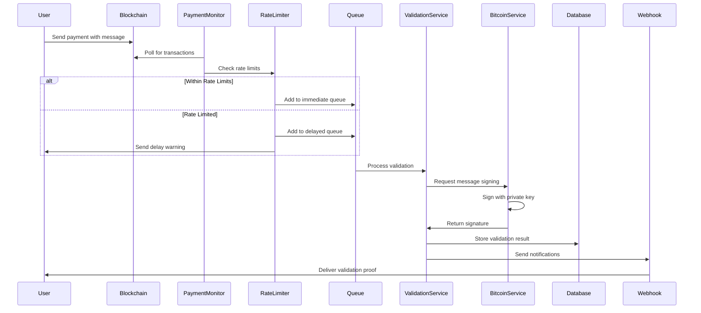

### Reserve Management Flow

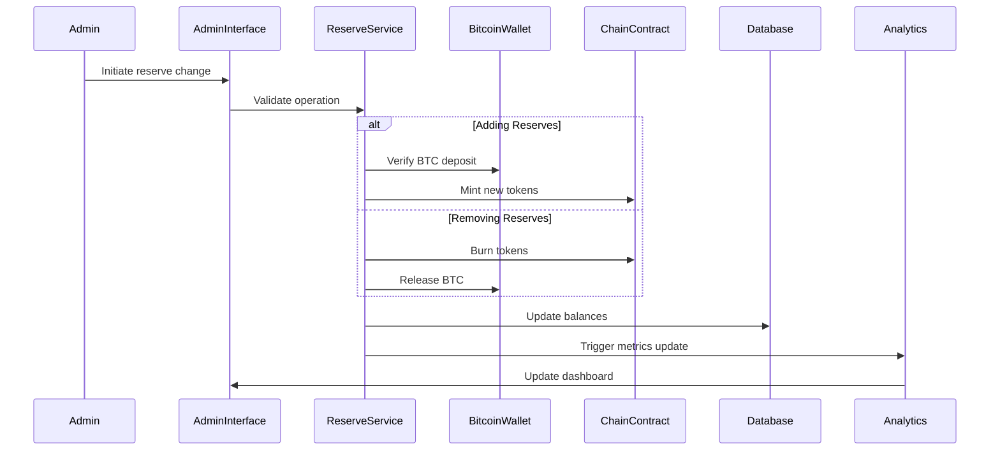

## 🌐 Multi-Chain Integration

### Blockchain Adapter Pattern

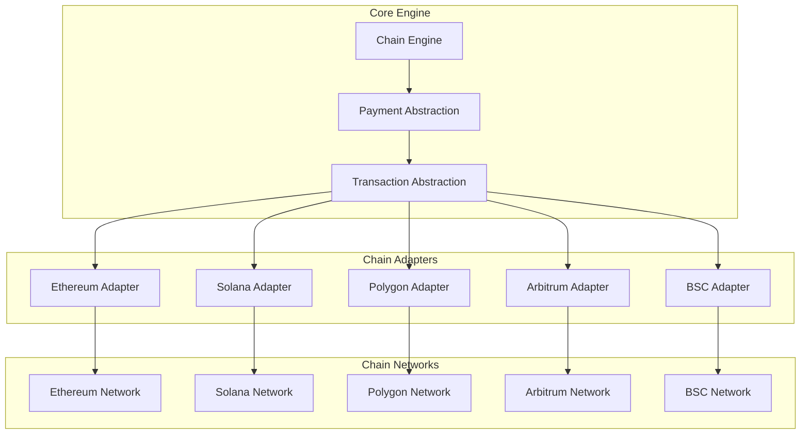

### Chain Configuration

```typescript
interface ChainConfig {
  name: string;
  rpcUrl: string;
  contractAddress?: string;
  paymentAddress: string;
  minimumPayment: bigint;
  confirmations: number;
  gasSettings: {
    gasPrice?: bigint;
    gasLimit: bigint;
  };
}

const chainConfigs: Record<string, ChainConfig> = {
  ethereum: {
    name: "Ethereum",
    rpcUrl: process.env.ETHEREUM_RPC_URL,
    contractAddress: "0x...",
    paymentAddress: "0x...",
    minimumPayment: parseEther("0.001"),
    confirmations: 12,
    gasSettings: {
      gasLimit: 100000n
    }
  },
  solana: {
    name: "Solana",
    rpcUrl: process.env.SOLANA_RPC_URL,
    paymentAddress: "...",
    minimumPayment: 10000000n, // 0.01 SOL in lamports
    confirmations: 32,
    gasSettings: {
      gasLimit: 200000n
    }
  }
};
```

## 📈 Scalability Architecture

### Horizontal Scaling Strategy

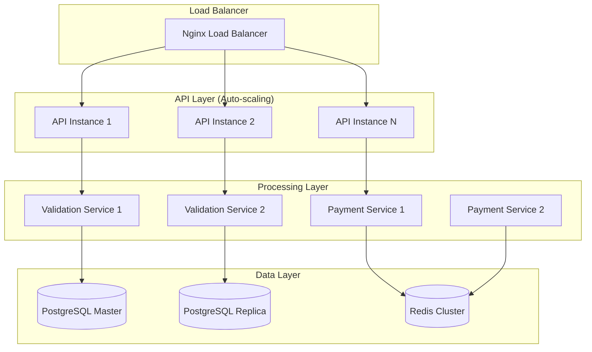

### Performance Optimization

1. **Database Optimization**
   - Read replicas for heavy queries
   - Connection pooling
   - Query optimization
   - Partitioning by chain/date

2. **Cache Optimization**
   - Multi-layer caching
   - Cache warming strategies
   - Intelligent invalidation
   - Edge caching (CDN)

3. **Queue Optimization**
   - Priority queues
   - Dead letter queues
   - Batch processing
   - Auto-scaling workers

## 📊 Monitoring & Observability

### Metrics Collection

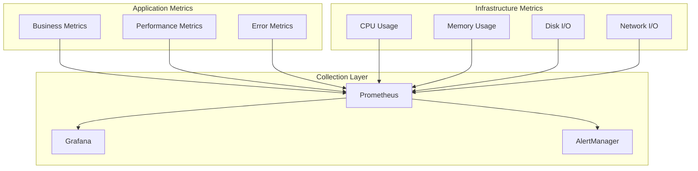

### Key Performance Indicators

**Business Metrics**
- Validation requests per hour/day
- Revenue per chain
- Reserve ratio health
- Customer satisfaction scores

**Technical Metrics**
- API response times (p50, p95, p99)
- Database query performance
- Queue processing times
- Error rates by service

**Security Metrics**
- Rate limit violations
- Authentication failures
- Suspicious activity patterns
- Security audit compliance

## 🚀 Deployment Architecture

### Container Architecture

```dockerfile
# Multi-stage build for production
FROM node:18-alpine AS builder
WORKDIR /app
COPY package*.json ./
RUN npm ci --only=production

FROM node:18-alpine AS runtime
RUN addgroup -g 1001 -S nodejs
RUN adduser -S nodejs -u 1001
WORKDIR /app
COPY --from=builder /app/node_modules ./node_modules
COPY --chown=nodejs:nodejs . .
USER nodejs
EXPOSE 3000
CMD ["node", "src/index.js"]
```

### Infrastructure as Code

```yaml
# docker-compose.yml
version: '3.8'
services:
  api:
    build: .
    ports:
      - "3000:3000"
    environment:
      - NODE_ENV=production
    depends_on:
      - postgres
      - redis
    deploy:
      replicas: 3
      restart_policy:
        condition: on-failure
        max_attempts: 3
  
  validation-service:
    build: .
    command: npm run start:validation
    environment:
      - NODE_ENV=production
    depends_on:
      - postgres
      - redis
    deploy:
      replicas: 2
  
  postgres:
    image: postgres:15
    environment:
      POSTGRES_DB: universal_btc
      POSTGRES_USER: ${DB_USER}
      POSTGRES_PASSWORD: ${DB_PASSWORD}
    volumes:
      - postgres_data:/var/lib/postgresql/data
    ports:
      - "5432:5432"
  
  redis:
    image: redis:7-alpine
    ports:
      - "6379:6379"
    volumes:
      - redis_data:/data

volumes:
  postgres_data:
  redis_data:
```

## 🔄 Disaster Recovery

### Backup Strategy

1. **Database Backups**
   - Automated daily full backups
   - Hourly incremental backups
   - Point-in-time recovery capability
   - Cross-region backup replication

2. **Key Backups**
   - Encrypted key backups
   - Multi-location storage
   - Recovery procedures testing
   - Access control auditing

3. **Code & Configuration**
   - Git repository backups
   - Configuration management
   - Infrastructure as code
   - Rollback procedures

### Recovery Procedures

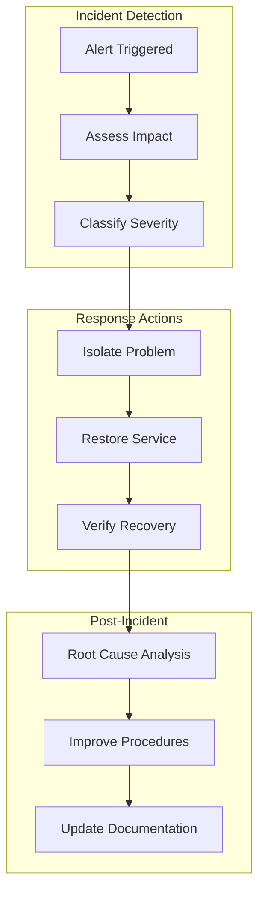

## 🔮 Future Architecture Considerations

### Phase 2 Enhancements

1. **Hardware Security Modules**
   - Migration to HSM-based key storage
   - Enhanced cryptographic operations
   - Compliance with banking standards

2. **Advanced Analytics**
   - Machine learning for fraud detection
   - Predictive analytics for demand
   - Advanced reporting capabilities

3. **Governance Integration**
   - DAO governance mechanisms
   - Community voting systems
   - Decentralized administration

### Phase 3 Expansions

1. **Cross-Chain Bridges**
   - Native bridge integrations
   - Automated liquidity management
   - Cross-chain arbitrage prevention

2. **Enterprise Features**
   - White-label solutions
   - Custom SLA agreements
   - Dedicated infrastructure

3. **Regulatory Compliance**
   - AML/KYC integration
   - Regulatory reporting
   - Compliance monitoring

---

This architecture document provides the foundation for building a robust, scalable, and secure WrappedBitcoin proof-of-reserves system. The design emphasizes transparency, security, and multi-chain compatibility while maintaining operational efficiency and user experience.