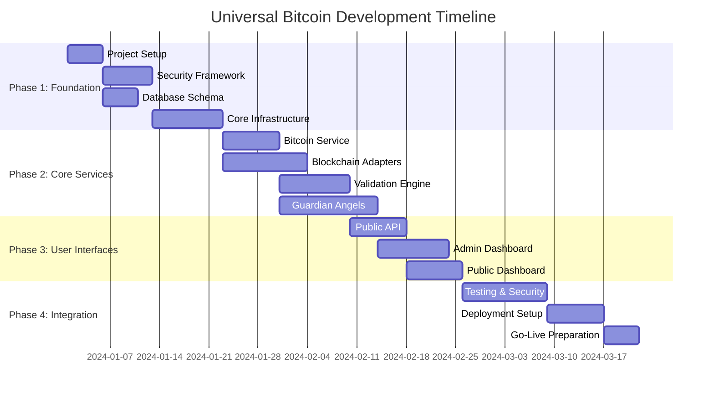
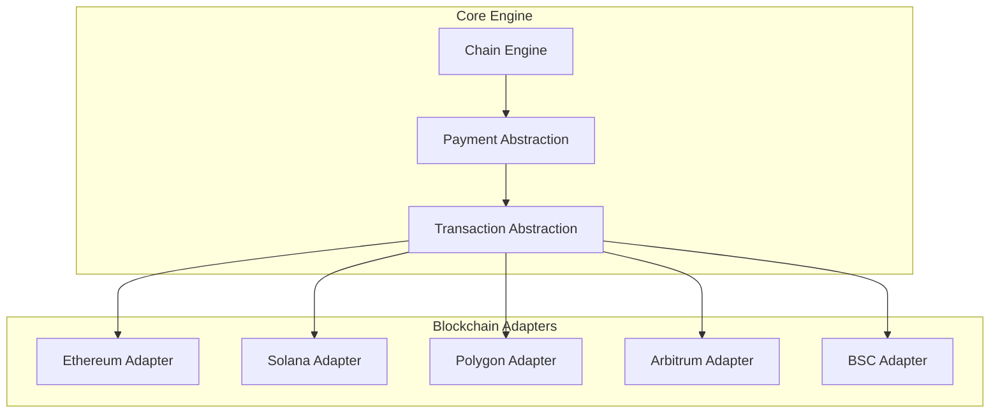
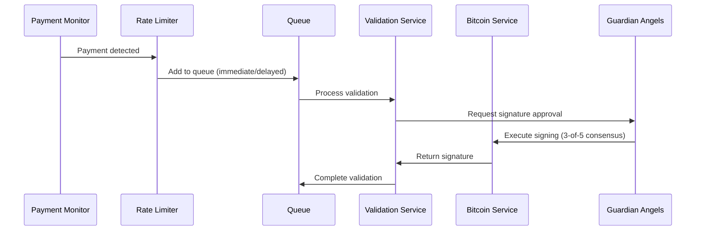

# Universal Bitcoin Development Plan

## 🎯 Project Status: Ready to Build

**✅ FOUNDATION COMPLETE**
- [x] Comprehensive documentation ([`README.md`](README.md))
- [x] System architecture ([`Architecture.md`](Architecture.md)) 
- [x] Cognitive framework ([`.kilocode/rules/MEMORY-MAP.md`](.kilocode/rules/MEMORY-MAP.md))
- [x] Development standards ([`.kilocode/rules/CODE-CONVENTIONS.md`](.kilocode/rules/CODE-CONVENTIONS.md))
- [x] Security guidelines ([`.kilocode/rules/SECURITY-GUIDELINES.md`](.kilocode/rules/SECURITY-GUIDELINES.md))

## 🚀 Implementation Strategy

### Development Approach: **Phased Delivery with Security-First Mindset**



## 📋 Phase 1: Foundation (2 weeks)

### 1.1 Project Initialization

**Deliverables:**
- Node.js project structure with TypeScript
- Package.json with all dependencies
- Environment configuration system
- Docker development environment

**Technical Specifications:**
```javascript
// Project structure following .kilocode/rules/CODE-CONVENTIONS.md
src/
├── api/                    # HTTP API layer
├── services/               # Business logic services
├── blockchain/             # Blockchain integrations
├── security/               # Security utilities
├── validation/             # Core validation engine
├── webhooks/               # Webhook system
├── models/                 # Data models
├── utils/                  # Utility functions
└── config/                 # Configuration files
```

### 1.2 Security Framework Implementation

**Priority: CRITICAL** - Following [`.kilocode/rules/SECURITY-GUIDELINES.md`](.kilocode/rules/SECURITY-GUIDELINES.md)

**Key Components:**
- [ ] AES-256-GCM encryption utilities
- [ ] Secure key derivation functions
- [ ] Guardian Angels multi-sig framework
- [ ] Rate limiting middleware
- [ ] Input validation schemas
- [ ] Security audit logging

**Code Example:**
```javascript
// src/security/encryption.util.js
class EncryptionUtil {
  static async encryptSensitiveData(data, key) {
    // Implementation following security guidelines
  }
}
```

### 1.3 Database Schema Setup

**Database Stack:**
- **Primary**: PostgreSQL 15+ for transactional data
- **Time-Series**: TimescaleDB for metrics
- **Cache**: Redis 7+ for caching and queues

**Core Tables:**
```sql
-- Following .kilocode/rules/CODE-CONVENTIONS.md naming
CREATE TABLE validations (
    id UUID PRIMARY KEY DEFAULT gen_random_uuid(),
    chain VARCHAR(50) NOT NULL,
    tx_hash VARCHAR(128) NOT NULL,
    from_address VARCHAR(128) NOT NULL,
    amount DECIMAL(20,8) NOT NULL,
    message TEXT NOT NULL,
    status VARCHAR(20) DEFAULT 'pending',
    bitcoin_signature TEXT,
    bitcoin_address VARCHAR(64),
    created_at TIMESTAMP DEFAULT NOW(),
    processed_at TIMESTAMP,
    UNIQUE(chain, tx_hash)
);
```

## 📋 Phase 2: Core Services (3 weeks)

### 2.1 Bitcoin Service Implementation

**Core Features:**
- [ ] Bitcoin message signing using BIP-137 standard
- [ ] Private key management with encryption
- [ ] Signature verification
- [ ] Address generation and validation

**Security Requirements:**
- Guardian Angels multi-sig for all operations
- Private keys never stored unencrypted
- Immediate memory clearing after use
- Comprehensive audit logging

### 2.2 Blockchain Adapters

**Multi-Chain Architecture:**


**Implementation Strategy:**
- Chain-agnostic core engine
- Pluggable adapter pattern
- Unified payment detection
- Standardized error handling

### 2.3 Validation Engine

**Processing Flow:**


**Key Features:**
- Rate limiting with revenue preservation
- Queue-based processing
- Guardian Angels consensus
- Comprehensive error handling
- Real-time status updates

### 2.4 Guardian Angels Implementation

**Multi-Signature Security Model:**
- **Threshold**: 3-of-5 Guardian Angels required
- **Geographic Distribution**: Guardians in different regions
- **Independent Validation**: Each Guardian validates independently
- **Audit Trail**: Complete logging of all Guardian actions

**Implementation Components:**
```javascript
// src/security/guardian.service.js
class GuardianConsensus {
  constructor(threshold = 3, total = 5) {
    this.threshold = threshold;
    this.total = total;
  }
  
  async requestSignature(message, validationId) {
    // Implementation following security guidelines
  }
}
```

## 📋 Phase 3: User Interfaces (2.5 weeks)

### 3.1 Public API Development

**API Endpoints:**
```
GET  /api/v1/reserves           # Get reserve status
POST /api/v1/validate           # Submit validation request
GET  /api/v1/validate/{id}      # Get validation result
GET  /api/v1/health             # Health check
GET  /api/v1/metrics            # Prometheus metrics
```

**API Standards:**
- RESTful design principles
- OpenAPI 3.0 specification
- Rate limiting per endpoint
- Comprehensive error responses
- Authentication where required

### 3.2 Admin Dashboard

**Features:**
- [ ] Reserve management interface
- [ ] Guardian Angels coordination
- [ ] System monitoring dashboards
- [ ] Audit trail viewing
- [ ] Configuration management

**Security:**
- Multi-factor authentication
- Role-based access control
- Guardian approval for critical operations
- Complete audit logging

### 3.3 Public Dashboard

**Features:**
- [ ] Real-time reserve ratios
- [ ] Validation request interface
- [ ] System health indicators
- [ ] Historical statistics
- [ ] Transparency reporting

**Design Principles:**
- Mobile-responsive design
- Real-time updates via WebSocket
- Accessible design (WCAG 2.1)
- Fast loading times (<3s)

## 📋 Phase 4: Integration & Deployment (2.5 weeks)

### 4.1 Testing Strategy

**Testing Pyramid:**
```
E2E Tests (10%)        ← Full system validation
Integration Tests (30%) ← Service interactions  
Unit Tests (60%)       ← Individual functions
```

**Test Categories:**
- **Unit Tests**: Individual function behavior
- **Integration Tests**: Service interactions
- **Security Tests**: Vulnerability scanning
- **Performance Tests**: Load and stress testing
- **E2E Tests**: Complete user workflows

### 4.2 Security Audit

**Pre-Deployment Checklist:**
- [ ] All private keys encrypted at rest
- [ ] No secrets in source code or logs
- [ ] Input validation on all endpoints
- [ ] Rate limiting implemented
- [ ] Authentication and authorization working
- [ ] SQL injection protection verified
- [ ] XSS protection enabled
- [ ] HTTPS enforced everywhere
- [ ] Guardian multi-sig tested
- [ ] Audit logging functional

### 4.3 Deployment Setup

**Infrastructure:**
- **Containerization**: Docker + Docker Compose
- **Orchestration**: Kubernetes (production)
- **CI/CD**: GitHub Actions
- **Monitoring**: Prometheus + Grafana
- **Logging**: ELK Stack

**Environment Progression:**
```
Development → Staging → Production
     ↓           ↓          ↓
Feature Flags  Load Tests  Monitoring
```

## 🔧 Technical Requirements

### Development Environment
- **Node.js**: 18+ LTS
- **Package Manager**: npm or yarn
- **Database**: PostgreSQL 15+, Redis 7+
- **Container**: Docker, Docker Compose

### Production Environment
- **Compute**: 4 vCPU, 16GB RAM minimum
- **Storage**: SSD with encryption at rest
- **Network**: Load balancer, CDN integration
- **Monitoring**: Real-time alerting

## 📊 Success Metrics

### Phase 1 Success Criteria
- [ ] Project builds without errors
- [ ] All security utilities functional
- [ ] Database migrations run successfully
- [ ] Docker environment operational

### Phase 2 Success Criteria
- [ ] Bitcoin message signing working
- [ ] All blockchain adapters functional
- [ ] Validation queue processing
- [ ] Guardian consensus operational

### Phase 3 Success Criteria
- [ ] All API endpoints functional
- [ ] Admin dashboard operational
- [ ] Public dashboard live
- [ ] End-to-end validation flow working

### Phase 4 Success Criteria
- [ ] All tests passing (95%+ coverage)
- [ ] Security audit completed
- [ ] Performance benchmarks met
- [ ] Ready for production deployment

## 🚨 Risk Management

### Technical Risks
- **Risk**: Guardian Angel coordination complexity
- **Mitigation**: Extensive testing, backup procedures

- **Risk**: Multi-chain integration challenges
- **Mitigation**: Phased rollout, comprehensive adapters

### Security Risks
- **Risk**: Private key compromise
- **Mitigation**: Guardian Angels multi-sig, encryption at rest

- **Risk**: Smart contract vulnerabilities
- **Mitigation**: Security audits, formal verification

### Business Risks
- **Risk**: Regulatory compliance
- **Mitigation**: Legal review, compliance monitoring

## 🎯 Next Steps

### Immediate Actions (This Week)
1. **Set up development environment**
2. **Initialize project structure**
3. **Implement security framework**
4. **Begin database schema implementation**

### Review Points
- **Week 2**: Security framework review
- **Week 4**: Core services review
- **Week 6**: UI/UX review
- **Week 8**: Final security audit

---

## 🎊 Ready to Build!

The project foundation is solid with:
- ✅ Comprehensive architecture
- ✅ Security-first approach
- ✅ Clear development standards
- ✅ Phased implementation plan

**Recommendation**: Proceed with Phase 1 implementation, starting with project setup and security framework.

Would you like me to switch to **Code mode** to begin implementation?